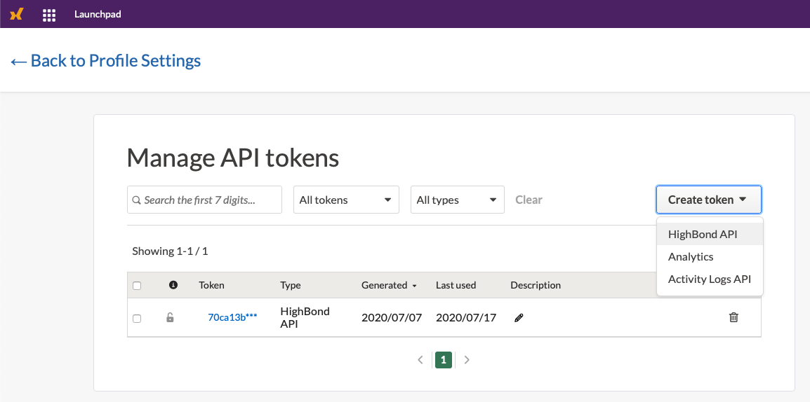
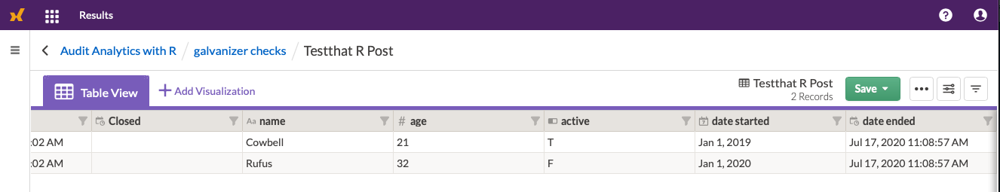

<!-- README.md is generated from README.Rmd. Please edit that file -->

```{r, include = FALSE}
knitr::opts_chunk$set(
  collapse = TRUE,
  comment = "#>",
  fig.path = "man/figures/",
  out.width = "100%"
)

  highbond_openapi <- Sys.getenv('highbond_openapi')
  highbond_org <- Sys.getenv('highbond_org')
  highbond_datacenter <- Sys.getenv('highbond_datacenter')
  highbond_table <- Sys.getenv('highbond_readme_results_table')
```

# galvanizer

<!-- badges: start -->
<!-- badges: end -->

galvanizer is a package designed to interact to Highbond's API (https://docs-apis.highbond.com). By using R with galvanizer, you can download data from Highbond's Results and Project modules. For Highbond Results, you can also process data locally and upload data into Highbond Result tables.

## Installation

You can install the currently available version of galvanizer from [CRAN](https://cran.r-project.org/web/packages/galvanizer/index.html):

``` {r eval=FALSE}
# Release:
install.packages('galvanizer')

# Development version:
# devtools::install_github("jonlinca/galvanizer")
```

## Getting started

Before using the API, you will need some core information to access your Highbond instance. They are:

* Highbond API token
* Organization number
* Data Center location

To generate a Highbond API token from your Highbond instance by referencing the [help files](https://help.highbond.com/helpdocs/highbond/en-us/Content/launchpad/getting_started/managing_access_tokens.html). This can be found on your profile page.



To identify your organization number and data center, best found from your Launchpad, under Options / Organization. The organization number will be under the format of `https://accounts.highbond.com/orgs/<ORGANIZATION_ID>/details`

To use any functions, you will need to create and pass a Highbond Authentication object. You can make it by passing the API token, organization / instance number and data center location to `setup_highbond()`:

```{r}
library(galvanizer)
highbond_auth <- setup_highbond(highbond_openapi, highbond_org, highbond_datacenter)
```

## Highbond Results data

Once you have those, then you need to identify the table you want to upload and download data from. The easiest way to do this is to navigate to the Results Data Analytic table you want to upload and grab the `TABLE_ID` from the URL. It will look like:

`https://<company_name>.results.highbond.com/projects/<COLLECTION_ID>/controls/<ANALYSIS_ID>/control_tests/<TABLE_ID>`

You can choose to upload a set of test data into a new Data Analytic to try this out:

```{r, message=FALSE}
upload <- data.frame(name = c('Cowbell', 'Rufus'),
                     age = c(21, 32),
                     active = c(TRUE, FALSE),
                     date_started = c(as.Date('2019-01-01'), as.Date('2020-01-01')),
                     date_ended = c(as.POSIXct(Sys.time()), as.POSIXct(Sys.time())))

# Substitute your API key, org number, data, center, table, and the dataframe to be uploaded
post_results_records(highbond_auth, highbond_table, upload = upload, purge = TRUE)
```

Once that has successfully uploaded into Highbond Results, you can view the results online and also download the new data too:



```{r}
download <- get_results_records(highbond_auth, highbond_table)

head(download$content$data)
```

## Highbond Projects data

Highbond Projects data (also known as 'Audits') is also retrievable, depending on which screen of information you would like to retrieve from. There are options to download all or just one set of information, depending on the pane chosen.

```{r}
projects <- get_projects(highbond_auth)
head(projects)
```